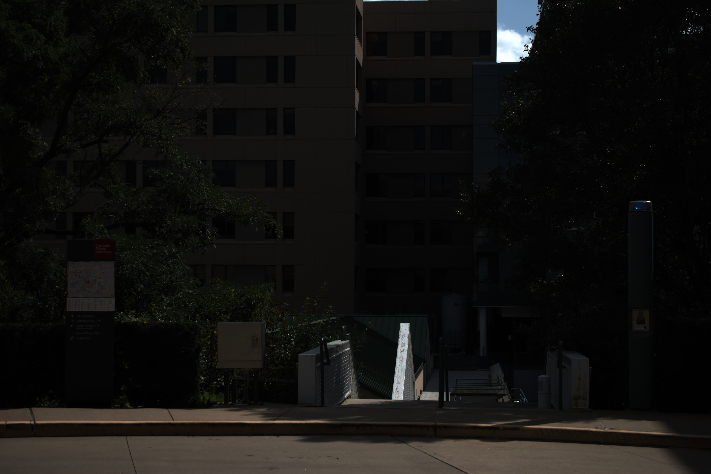
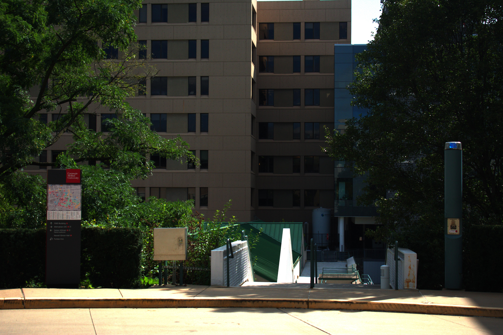
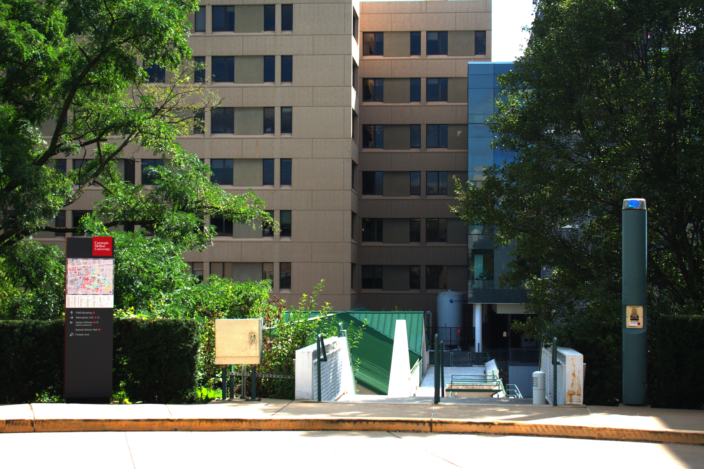
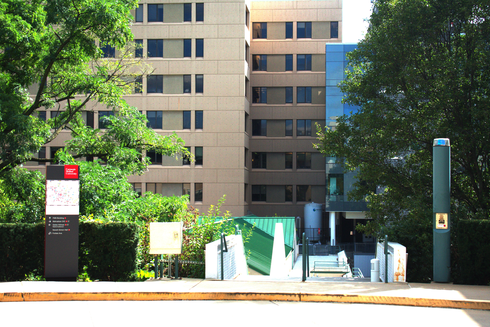
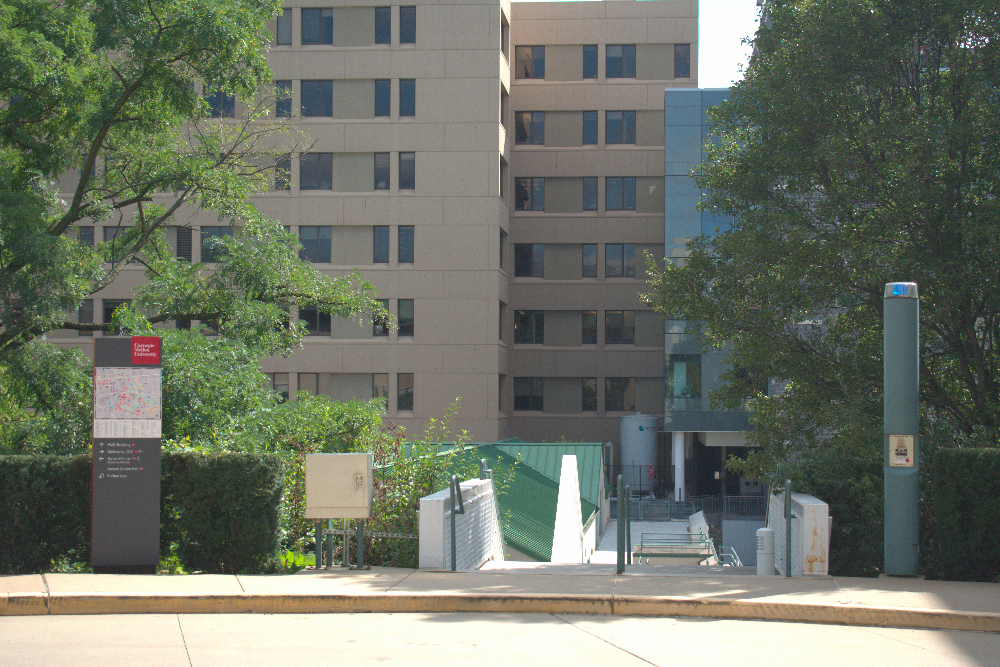
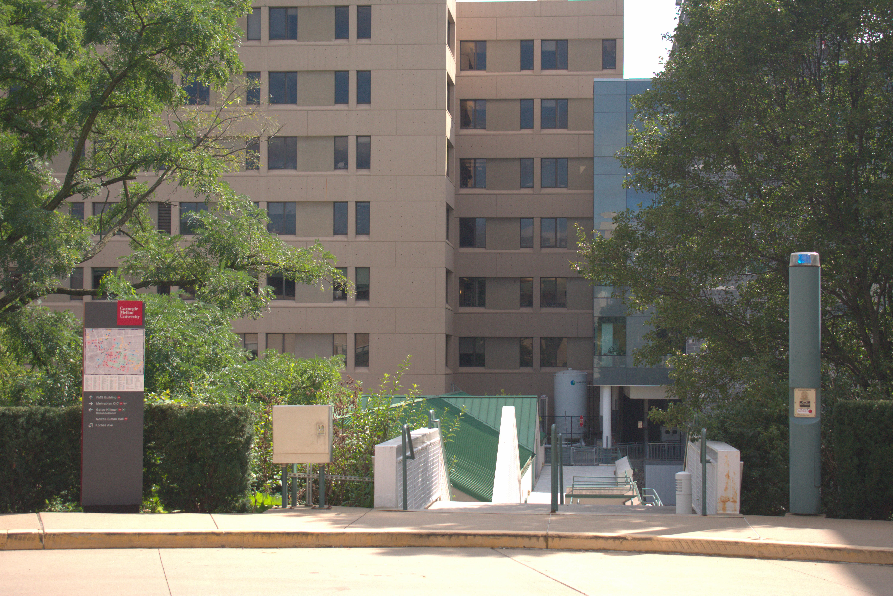
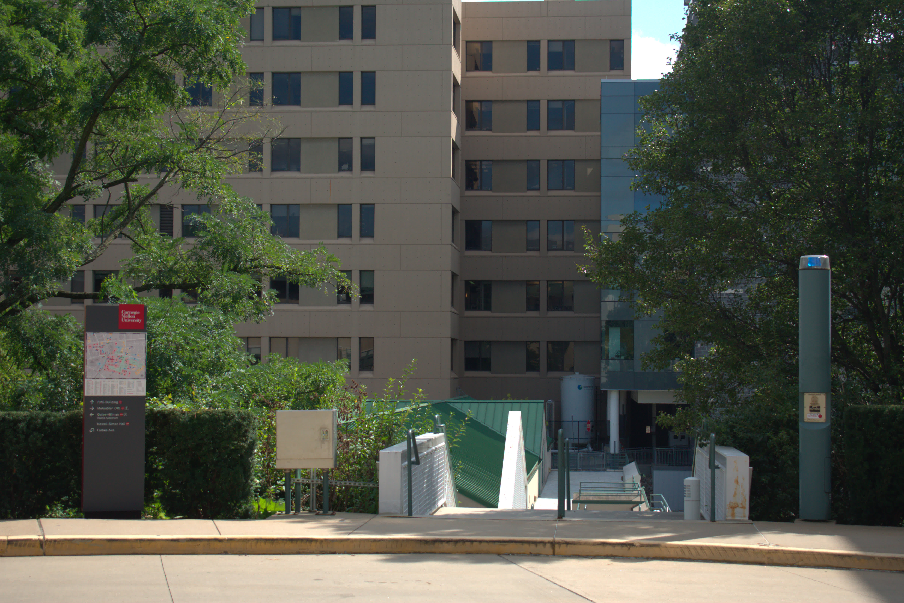

# Homework Assignment 1

15-663, Computational Photography, Fall 2022, Carnegie Mellon University

Chenhao Yang

---

## 1. Developing RAW images

### 1.1 Implement a basic image processing pipeline (80 points)

#### RAW image conversion (5 points).

| black | white | R scale  | G scale  | B scale  |
| ----- | ----- | -------- | -------- | -------- |
| 150   | 4095  | 2.394531 | 1.000000 | 1.597656 |

#### Python initials (5 points).

| BPP  | Width | Height |
| ---- | ----- | ------ |
| 16   | 6016  | 4016   |

Check and report how many bits per pixel the image has, its width, and its height. Then, convert the image into a double-precision array

#### Linearization (5 points).

Implemented using `numpy.clip()`.

#### Identifying the correct Bayer pattern (20 points).

The correct Bayer pattern is **RGGB**. To look for it, we can plot all four combinations as followings:


From left to right, upper to lower: the patterns used for plotting are 'grbg', 'rggb', 'bggr', 'gbrg'.

We can easily find that pattern `rggb` gives us the most realistic color distribution.

#### White balancing (10 points).

Result using white world assumption:


Result using gray world assumption:


Result using camera presets:


#### Demosaicing (10 points).

Implemented using `interp2d`.

#### Color space correction (10 points).

For Nikon D3400, the $$M_{XYZ→cam}$$ coefficient is 

```
{ "Nikon D3400", 0, 0,
	{ 6988,-1384,-714,-5631,13410,2447,-1485,2204,7318 } },
```

as found in [source code](https://github.com/ImageMagick/dcraw/blob/e95250991368bd8bd89828ebbd2e41456e5ba4fd/dcraw.c#L7625) of `dcraw`.

The color correction matrix $$M_{sRGB→cam}$$ is 

[[ 5.74517316e-01  3.17795088e-01  1.07687596e-01] 

[ 5.37863305e-02  7.33831689e-01  2.12381981e-01]

 [-2.60393071e-04  2.18870826e-01  7.81389567e-01]]

Before correction:


After correction:



#### Brightness adjustment and gamma encoding (10 points).

Brightness: 25%



Brightness: 50%



Brightness: 75%



Personally, I think 50% brightness is the best of them all, as 25% has some under exposure areas and 75% has some over exposure areas.


However, after Gamma encoding, I found that it has effect of "brighten the image" because gamma curve enlarges the darken areas, so I finally chose brightness 25% to proceed:



#### Compression (5 points).

There are no difference visible between the PNG file and JPEG file saved, here's the table displaying compression ratio with different save settings:

|        File type        |   Size   | Compression ratio |
| :---------------------: | :------: | :---------------: |
|   PNG (uncompressed)    | 37498105 |         1         |
| JPEG (compressed - 95%) | 8485744  |     22.6298%      |
| JPEG (compressed - 90%) | 5339647  |     14.2398%      |
| JPEG (compressed - 80%) | 3315538  |      8.8419%      |
| JPEG (compressed - 70%) | 2531983  |      6.7523%      |
| JPEG (compressed - 60%) | 2041476  |      5.4442%      |
| JPEG (compressed - 50%) | 1728219  |      4.6088%      |
| JPEG (compressed - 40%) | 1445730  |      3.8555%      |
| JPEG (compressed - 30%) | 1174485  |      3.1321%      |
| JPEG (compressed - 20%) |  896503  |      2.3908%      |
| JPEG (compressed - 10%) |  620495  |      1.6547%      |
|                         |          |                   |

The lowest setting for which the compressed image is indistinguishable from the original is a bit subjective, generally I believe compression rate over 20% will perserve most of the information.

### 1.2 Perform manual white balancing (10 points)

I tried sky and a white wall in the picture as the white object, turns out that the white wall is a better object to perform white balancing on:

Patch at the **sky**:


Patch at the **White wall**:



The patches at the white wall works the best.

### 1.3 Learn to use dcraw (10 points)

```shell
dcraw -w -o 1 -q 0 -b 1.1 -g 2.4 4.5 campus.nef
```

-q 0: Use high-speed, low-quality bilinear interpolation.

-o 1: sRGB color space

-w : Use the white balance specified by the camera

-b <num>:  Adjust brightness

-g 2.4 4.5: Set custom gamma curve

From manufacturor:


By `dcraw`:



Developed by myself:


The difference between these pictures is nuance. The only noticable would be the picture developed by myself looks brighten and whiten then the other two, it may caused by different gamma encoding settings and brighten settings.

I like the manufacturor's picture better since it perserved more details, the color looks more nature and have more contrast, but overall, they all look good to me.	

## 2. Camera Obscura


### 2.1 Build the pinhole camera (70 points)

### 2.2 Use your pinhole camera (30 points)

### 2.3 Bonus: Camera obscura in your room (20 points)
