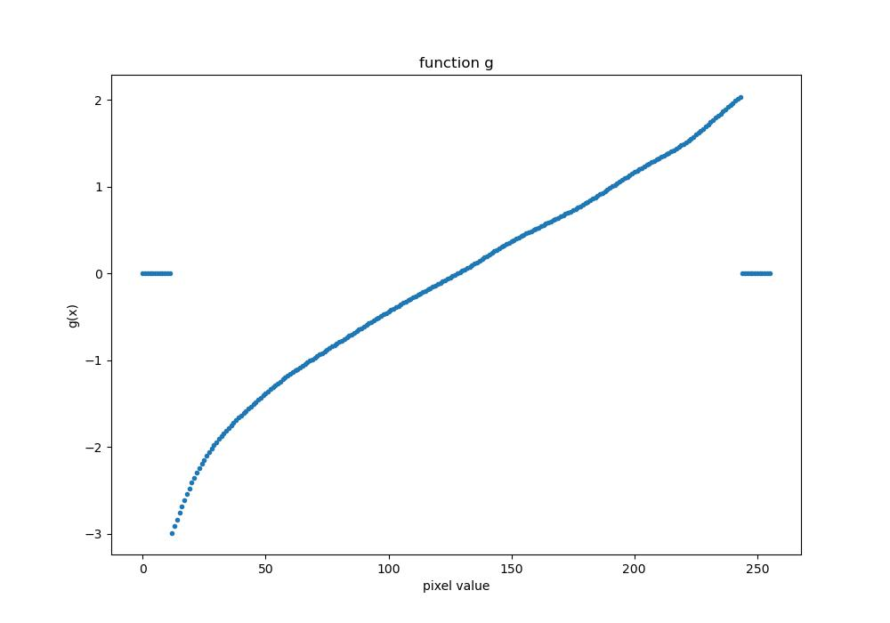

# Homework Assignment 2

15-663, Computational Photography, Fall 2022, Carnegie Mellon University

Chenhao Yang

---

## 1. HDR imaging

### Develop RAW images

The following command was used for developing RAW images took with a Nikon camera:

```shell
dcraw -q 3 -T -4 -f -w -o 1 <input image name>.NEF
```

```
-q 3 : Use Adaptive Homogeneity-Directed (AHD) interpolation.
-T   : Write TIFF with metadata instead of PDM/PPM/PAM.
-4   : Linear 16-bit.
-f   : Interpolate RGB as four colors.
-w   : Use the white balance specified by the camera.
-o 1 : sRGB D65 (default) color space.
```

### Linearize rendered images

Plot of function g recovered:




*The weight function used for computing g in this plot is uniform scheme

### Merge exposure stack into HDR images

The parameters I used are `z_min=0.05`, `z_max=0.95` for both linear and logarithmic merging.

The best merge result of my pick:


Note that the image has been applied gamma encoding after merging (as this caused the picture to be "paler" than original)

| Input data | Weight scheme | Merge type  |
| ---------- | ------------- | ----------- |
| .jpg files | tent          | logarithmic |

The reason that I select this photo is that among all images, this one shows most information, where at the dark region (right part of the picture) we can see most of the details on the bookshelf and at the bright region (left part of the picture) we can also see the details of the drawing hand on the wall, except for blurs. This picture also has no artifects with regards to color before tone mapping.

## 2. Color correction and white balancing

| Without color correction  | With color correction       |
| ------------------------- | --------------------------- |
|  |  |

I appreciate the one without color correction more because it looks warmer than the one with correct color correction and white balancing, it makes me feel more comfortable and looks more authethic as a study room with bookshelf etc. to me.

## 3. Photographic tonemapping

| RGB method                | Luminance method       |
| ------------------------- | ---------------------- |
|  |  |

For photographic tonemapping, the RGB method is much better than luminance method here, with tunable parameter `key` and `burn`, we can adjust the overall brightness and contrast between the bright and dark areas. However, just adjusting luminance doesn't give us the possibility to adjust the contrast. As we can find out from the results above. The RGB method (photographic tonemapping) shows more details in the darken area while maintaining about the same brightness as the result with luminance method.


## 4. Create and tone map your own HDR photo

Input stacks:

This set of pictures are taken inside my apartment's kitchen, there are dark regions where shows the indoor kitchen and bright regions where shows outdoor sunlight.

|Exposure time| 1/4096                          | 1/2048                          | 1/1024                          | 1/512                           | 1/256                           | 1/128                           | 1/64                            | 1/32                            |
| ------------------------------- | ------------------------------- | ------------------------------- | ------------------------------- | ------------------------------- | ------------------------------- | ------------------------------- | ------------------------------- | ------------------------------- |
|Pictures|  |  |  |  |  |  |  |  |

After RAW and JPG merging, I selected the best merged result and proceeded with photographic tonemapping, here are some parameters that I tried:

| K = 0.001, B = 1                   | K = 0.2, B = 0.1                  |
| ---------------------------------- | --------------------------------- |
|      |     |
| K = 0.002 B = 0.1                  | K = 0.002, B = 0.01               |
|    |  |
| K = 0.002, B = 0.001               | K = 0.002, B = 1                  |
|  |     |

Best result of my choice:

Photographic tone mapping with `Key=0.002`, `Burn=1`:


We can notice that both indoor details like the coffee kettle and outdoor details like trees and house are preserved in the same picture.

## 5. Noise calibration and optimal weights

Histogram of values across various dark images:

|                            |                            |
| -------------------------- | -------------------------- |
|  |  |
|  |  |
|  |  |

The histogram follows normal distribution. After extracting photon noise (dark noise) from the images, the remaining noises are **read** and **ADC** noise, they come from the consequence of random voltage fluctuations before and after amplifier.

- Both are independent of scene and exposure.

- Both are normally (zero-mean Guassian) distributed.


Mean and Variance plot:


The gain and intercept estimated:

Gain = 1.3291

Intercept = 295.8169


Result using Optimal weights:

| w/t optimal weights            | w/ optimal weights   |
| ------------------------------ | -------------------- |
|  |  |

The dark pixels are better than previous result, because dark pixels suffer from **read** and **ACD** noise mainly, and here using optimal weight we reduce these noises.

