# Homework Assignment 4

15-663, Computational Photography, Fall 2022, Carnegie Mellon University

Chenhao Yang

---

## Lightfield rendering, depth from focus, and confocal stereo

### Sub-aperture views


### Refocusing results

| 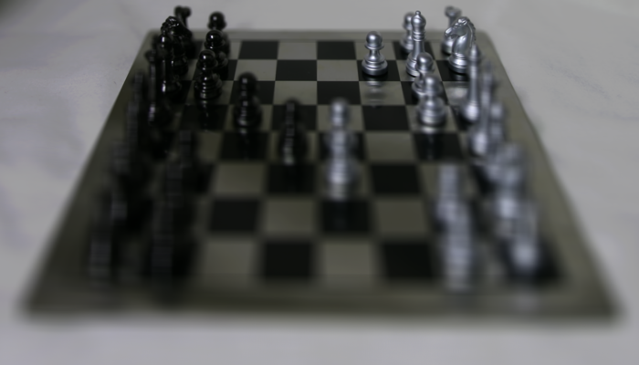 | 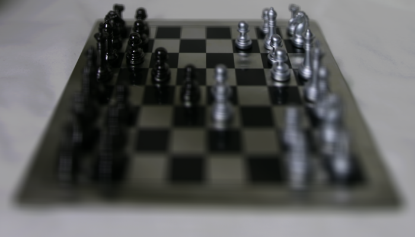 |
| ---------------------------------------- | ---------------------------------------- |
|  |  |
|  |  |
|  | 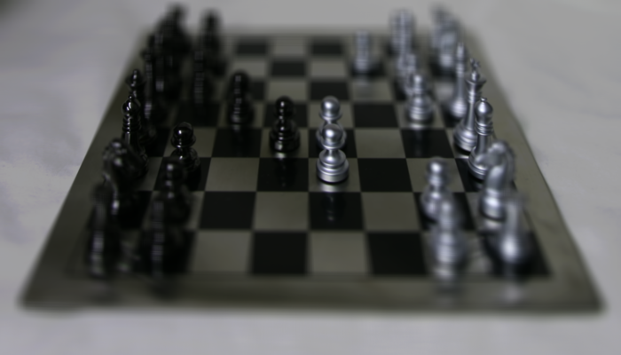 |
| 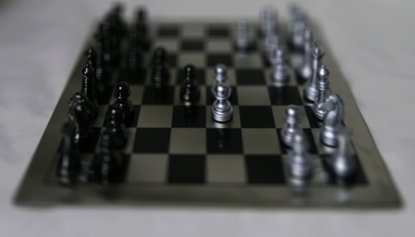 | 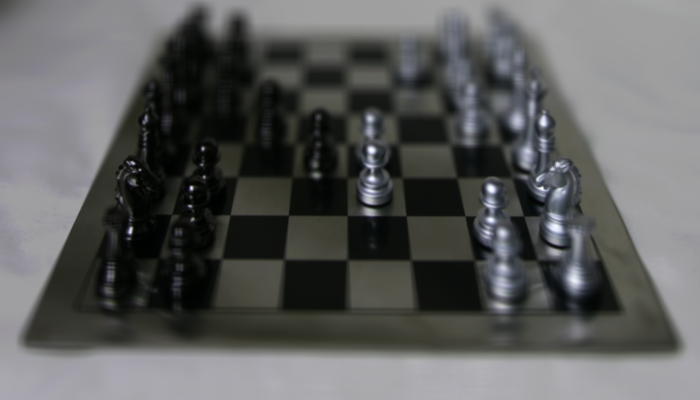 |


### All-in-focus image and depth from focus

| All-in-focus                 | Depth from focus                             |
| ---------------------------- | -------------------------------------------- |
|  | 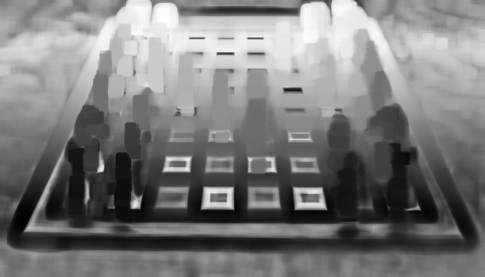 |

For creating the depth map, I used`kernal_size=17`,  `sigma_1=0.5` and `sigma_2=2` in gaussian filtering. 

The depth in parts where lack of texture such as the blank chessboard and table are estimated incorrectly. This is because depth from focus basically calculates the local sharpness of the scene and use as weights, so the scene requires rich texture to show sharpness and sharing with neighbors. In sections that lacks rich texture, like blank chessboard, there's no sharpness so the weight for these areas are close to zeros all the time.

The all-in-focus image are not affected by this issue, because pixels at these non-textured areas remain same across sub-aperture views.


## Focal-aperture stack and confocal stereo

Focal-aperture stack:


Randomly selected AFIs:

| 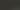 |  | 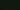 |
| ----------------------------------------------------- | ------------------------------------------------------ | ------------------------------------------------------ |

**Notes:** The AFIs here presented are not satisfying and we cannot visually identify too much difference across the patch. We will explain the reasons later with depth map estimated.


All-in-focus and depth map estimated using confocal stereo:

| All-in-focus                        | Depth map                        |
| ----------------------------------- | -------------------------------- |
|  | 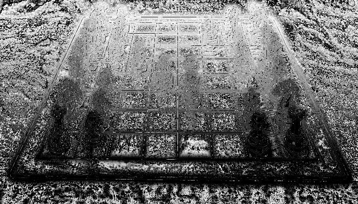 |

While the all-in-focus image seems fine with confocal stereo, the depth map estimated are not so satisfying compared with previous method and *Hassinoff and Kutulako*:

- We do not have a wide range of aperture and focal settings like the paper has, this make AFIs not apparent
- The scene doesn't contain same amount of texture as the paper has
- The depth map computed using confocal stereo is pixel wise and doesn't use neighbouring information like previous method, so it looks containing a lot of noise


## Capture and refocus your own lightfield

The unstructured lightfield samples I captured are as follows:

|  |  |  |
| ---------------------------------- | ---------------------------------- | ---------------------------------- |
|    |    |    |

The full video is located at `data/IMG_7346.MOV`.

### Refocusing an unstructured lightfield

Here we are matching template from a patch of the scene by computing normalized cross-correlation. I used `scipy.signal.correlate2d` to calculate the numerator and demoninator of equation (9):

- Use user selected focus point to create a local patch as template
- subtract mean from template and image that is going to match
- the numerator of normalized cross-correlation is `correlate2d(image, template)`
- the denominator of normalized cross-correlation is `correlate2d(image**2, template**2)`

code-wise (in `python`):

```python
image = image_g - image_g.mean()
template = template_g - template_g.mean()

image_square = image**2
template_square = template**2

corr_numerator = correlate2d(image, template, boundary="symm", mode="same")
corr_denominator = np.sqrt(
    correlate2d(image_square, template_square, boundary="symm", mode="same")
)
h = corr_numerator / corr_denominator
r, c = np.unravel_index(np.argmax(h), h.shape)  # find the match
```

 

**Results**

| Focus on tiger                | Focus on pumpkin                | Focus on flower                |
| ----------------------------- | ------------------------------- | ------------------------------ |
| 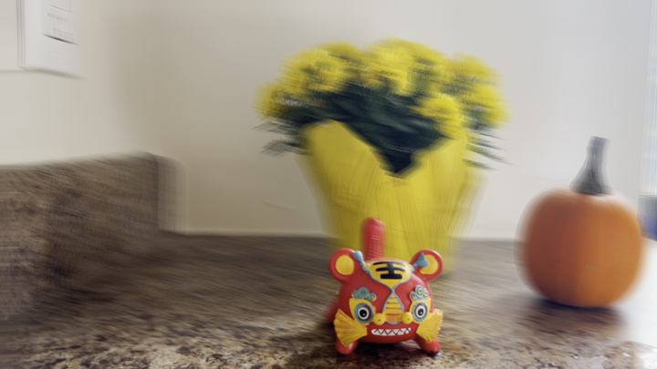 | 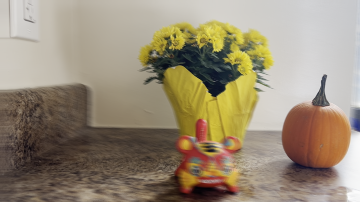 |  |

For competition:


---

