# Homework Assignment 5

15-663, Computational Photography, Fall 2022, Carnegie Mellon University

Chenhao Yang

---

The purpose of this assignment is to explore photometric stereo as a computational imaging technique for recovering the shape of an object. Photometric stereo takes as input images of an object under a fixed orthographic camera and multiple illumination directions. By assuming that the object is Lambertian and the illumination directional, per-pixel albedoes, normals, and eventually depth can be recovered using simple linear algebraic operations.

In the first part, we used data captured by us to implement two types of photometric stereo: uncalibrated, where we did not know the lighting directions, and calibrated, where we know the lighting directions. By comparing the two, we can notice the generalized bas-relief ambiguity [2] that exists in the uncalibrated case. In the second part, we used our own uncalibrated photometric stereo to measure the shape of some objects (up to a generalized bas-relief ambiguity), by capturing images with our own camera. 

## Photometric Stereo

### Uncalibrated photometric stereo

#### Original  estimated results

The normal map and albedo map we recovered for uncalibrated photometric stereo(unknown light source):

| Normal                               | Albedo                               |
| ------------------------------------ | ------------------------------------ |
| 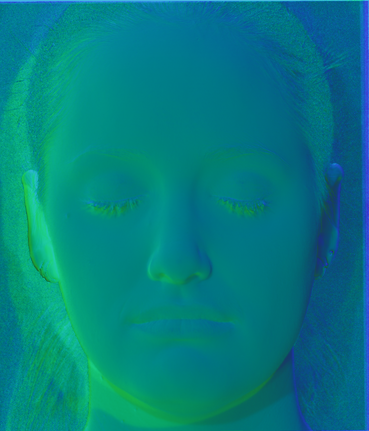 |  |

Additionally, select any non-diagonal matrix Q, and visualize the albedo AQ and normals NQ you compute from the corresponding BQ.

#### With $Q$ applied results

- For 
  $$
  Q = \begin{pmatrix}
  1&0&0\\
  0&1&0\\
  0&0&-1
  \end{pmatrix}
  $$

  | Normal                                  | Albedo                                  |
  | --------------------------------------- | --------------------------------------- |
  | 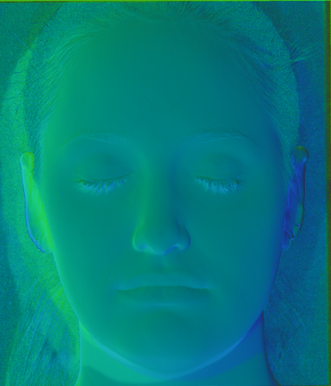 | 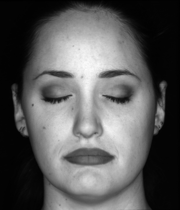 |

- For

$$
Q = \begin{pmatrix}
0.3745744 & 0.47407303 &0.97756414\\
0.81563322 &0.44387733 &0.7039967 \\
0.47043841 &0.34620286 &0.79587492
\end{pmatrix}
$$

| Normal                                  | Albedo                                  |
| --------------------------------------- | --------------------------------------- |
| 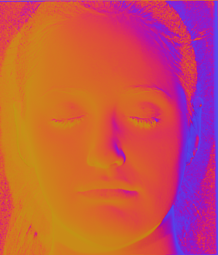 | 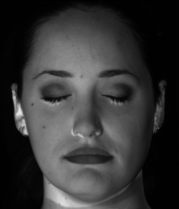 |

- For
  $$
  Q = \begin{pmatrix}
  0.18776312 &0.25619064& 0.17632636\\
  0.65363315 &0.41192409& 0.92145964\\
  0.66033095& 0.24435915 &0.54591866
  \end{pmatrix}
  $$

  | Normal                                  | Albedo                                  |
  | --------------------------------------- | --------------------------------------- |
  | 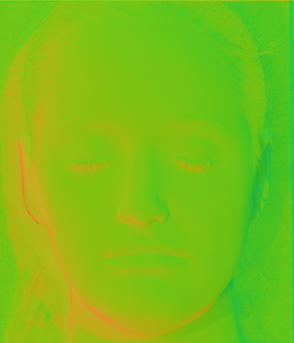 | 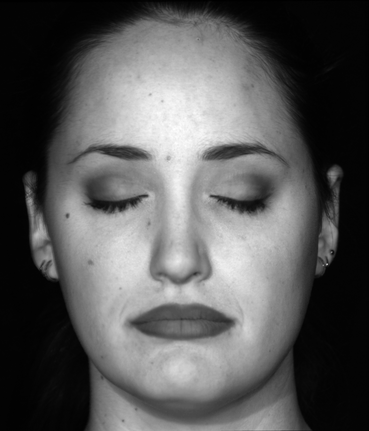 |

  

### Enforcing integrability

The blur kernel $\sigma$ used in final results: `sigma=10`

| Albedo                           | Normal                       | Depth                  |
| -------------------------------- | ---------------------------- | ---------------------- |
| 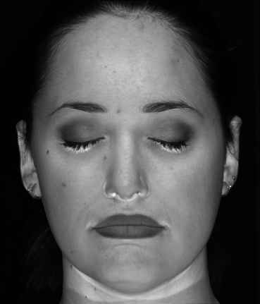 |  | 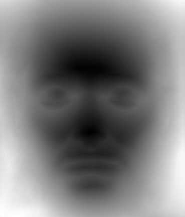 |

### Normal integration

| 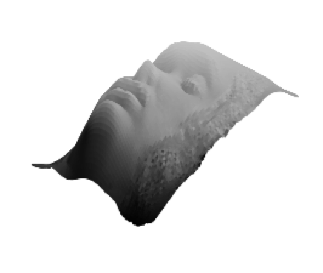 | 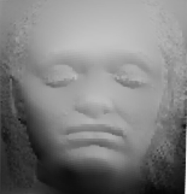 |
| ---------------------------- | ---------------------------- |
|                              |                              |

### Experiment with GBR transformation

$\lambda=0.1,\;\mu=\nu=0$

| Albedo                    | Normal                    | Depth                    |
| ------------------------- | ------------------------- | ------------------------ |
| 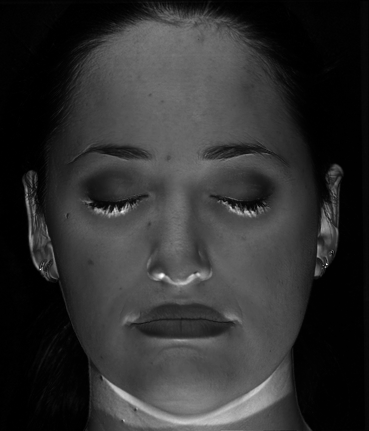 | 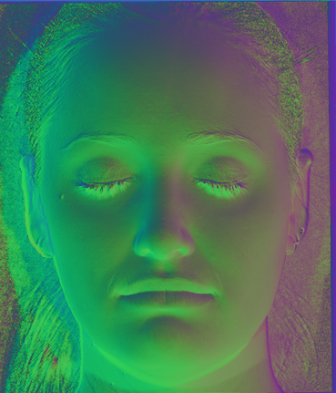 | 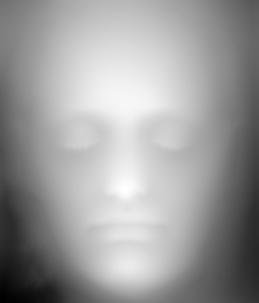 |

| 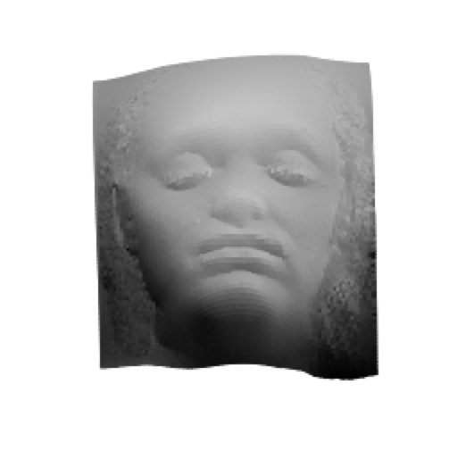 | 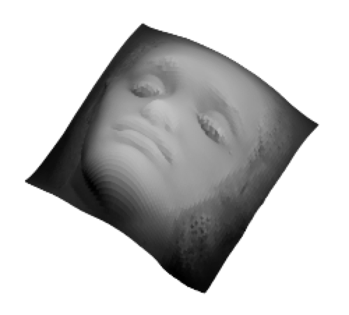 |
| ----------------------- | ----------------------- |

### Calibrated photometric stereo

| Albedo                             | Normal                             | Depth                             |
| ---------------------------------- | ---------------------------------- | --------------------------------- |
| 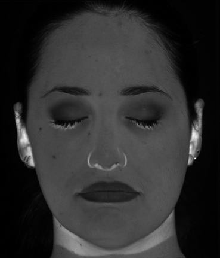 | 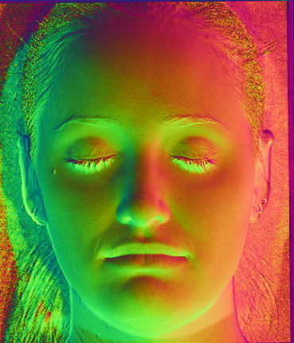 | 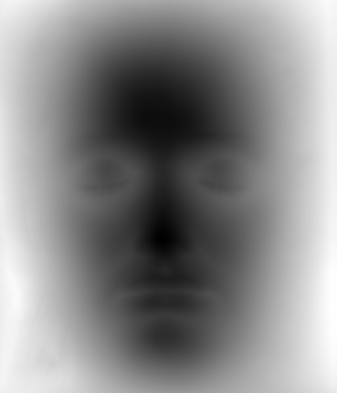 |

| 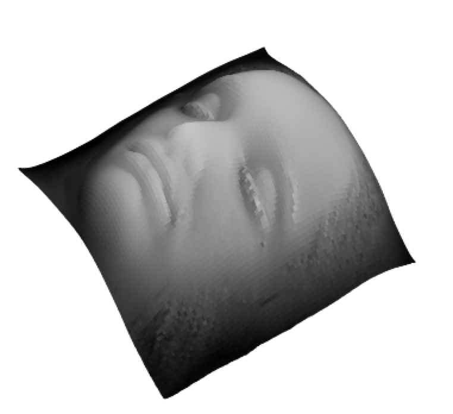 | 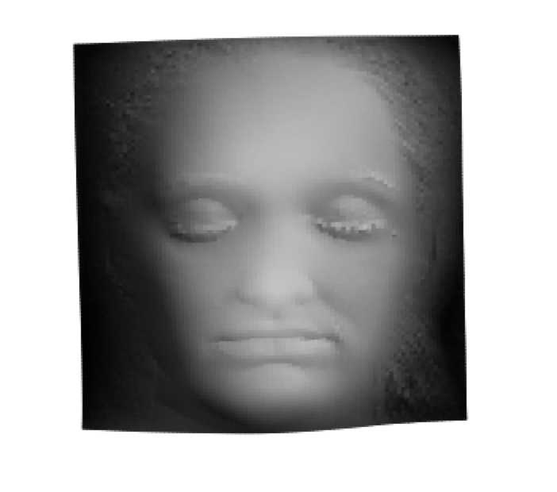 |
| -------------------------------- | -------------------------------- |

The results of calibrated and uncalibrated results are similar, except for normal map, the difference comes from the ambiguity when decomposing illumination.

## Capture and Reconstruct own shapes

About data:

During the experiment, we found that the **shadows** of the captured object worsen the reconstruction results. Therefore, in addition to capturing scene by descripted method, we used salient object detector to get a mask of the object and removed background.

### "Good" scene

Approximately satisfies the assumptions of photometric stereo (very diffuse reflectance without much/any glossiness, few interreflections and occlusions).

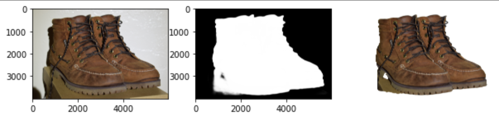

| Albedo                   | Normal                   | Depth                   |
| ------------------------ | ------------------------ | ----------------------- |
| 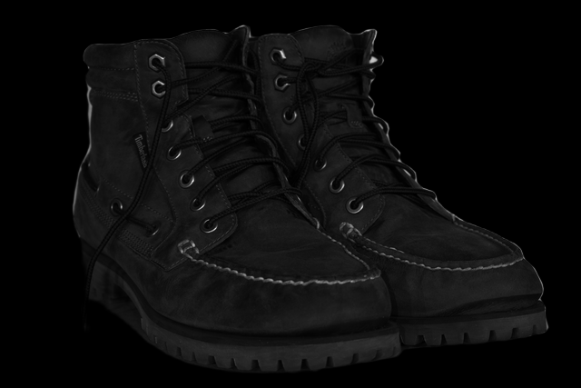 | 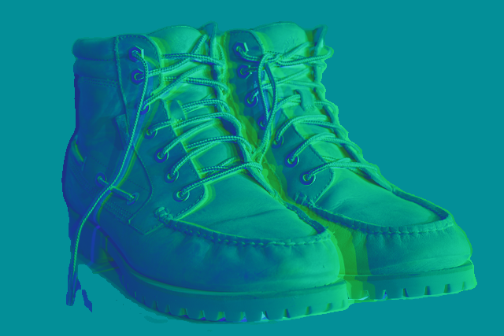 | 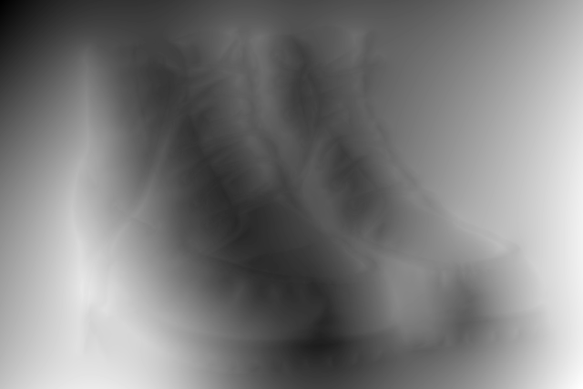 |

| 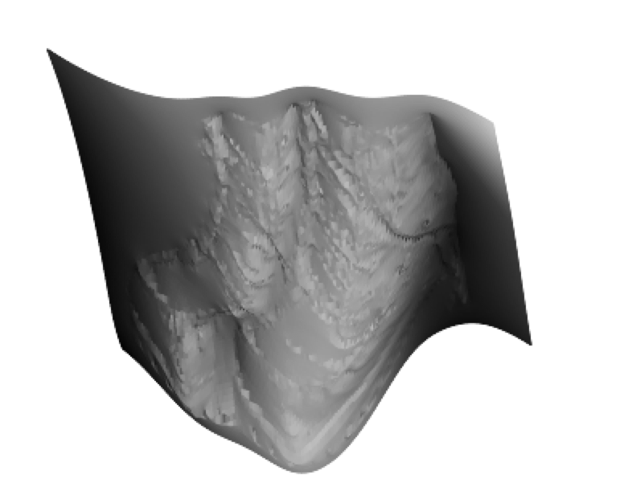 | 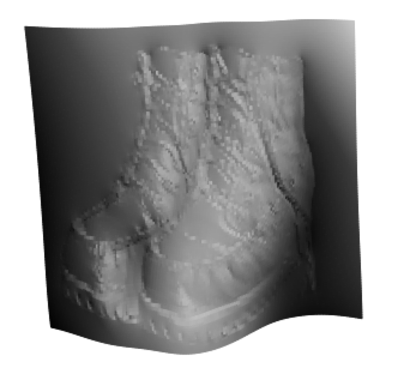 |
| -------------------------- | -------------------------- |

Although not perfectly capturing the geometry of the shoes, the reconstructed results did show some general shape of the shoes and the texture on it.

New render:

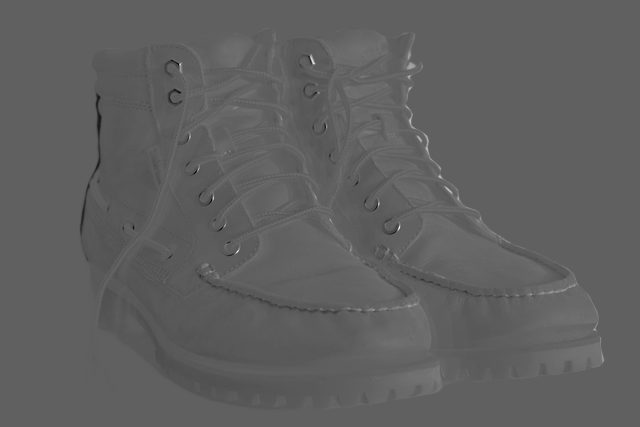

### "Bad" scene

Partially violates the assumptions of photometric stereo (e.g., it has a somewhat glossy reflectance, or it has strong convavities).

For this scene salient object detector cannot get a good mask for it.

| Albedo                    | Normal                    | Depth                    |
| ------------------------- | ------------------------- | ------------------------ |
| 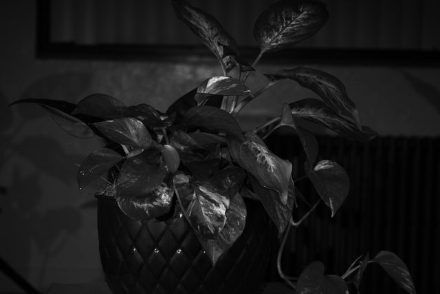 |  | 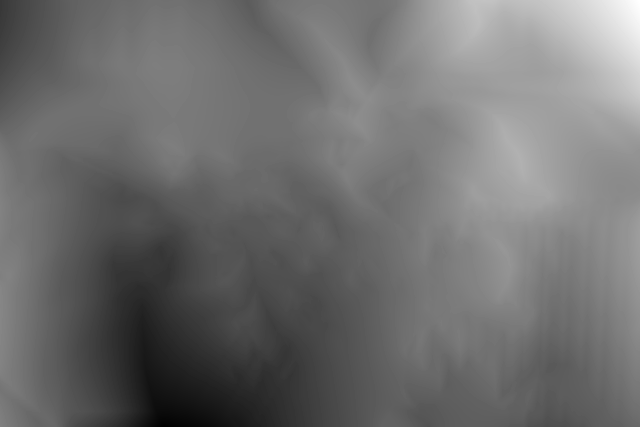 |

| 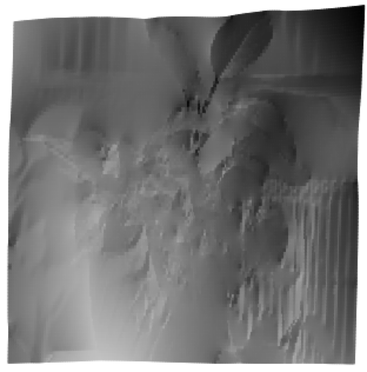 | 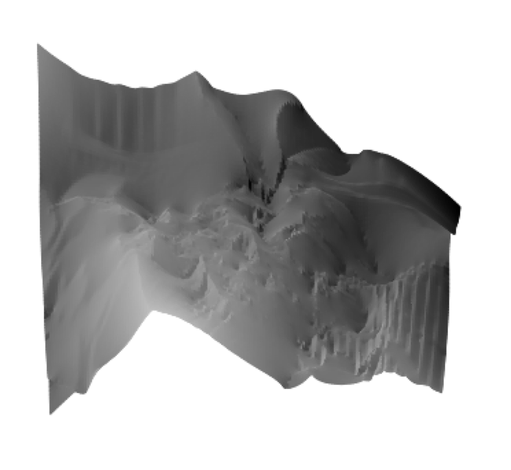 |
| --------------------------- | --------------------------- |

The scene violated assumptions of photometric stereo in two ways: the leave surfaces are glossy and there are quite a lot of cavities between them. We can notice that the reconstruction results are not as good as previous shoes scene.

## Reference

1. [1]  N. G. Alldrin, S. P. Mallick, and D. J. Kriegman. Resolving the generalized bas-relief ambiguity by entropy minimization. In Computer Vision and Pattern Recognition, 2007. CVPR’07. IEEE Conference on, pages 1–7. IEEE, 2007.
2. [2]  P. N. Belhumeur, D. J. Kriegman, and A. L. Yuille. The bas-relief ambiguity. International journal of computer vision, 35(1):33–44, 1999.
3. [3]  R. Frankot and R. Chellappa. A method for enforcing integrability in shape from shading algorithms. IEEE Transactions on Pattern Analysis & Machine Intelligence, (4):439–451, 1988.
4. [4]  T. Papadhimitri and P. Favaro. A new perspective on uncalibrated photometric stereo. In Proceedings of the IEEE Conference on Computer Vision and Pattern Recognition, pages 1474–1481, 2013.
5. [5]  A. Yuille and D. Snow. Shape and albedo from multiple images using integrability. In Computer Vision and Pattern Recognition, 1997. Proceedings., 1997 IEEE Computer Society Conference on, pages 158– 164. IEEE, 1997.

convert light1.tiff -gravity Center -extent 3500x3500-500+0 -resize 480x-1 light_1.tiff
