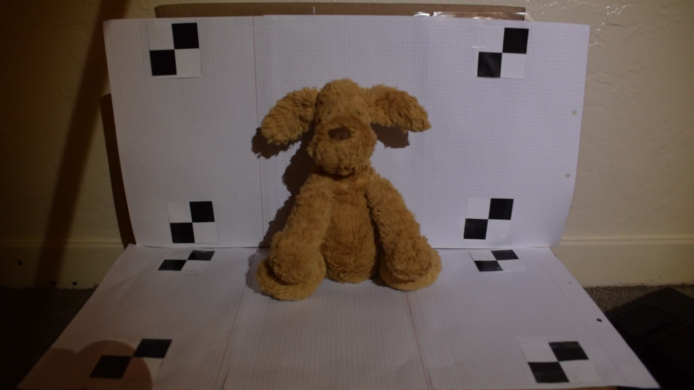

# Homework Assignment 6

15-663, Computational Photography, Fall 2022, Carnegie Mellon University

Chenhao Yang

---

The purpose of this assignment is to use structured light to reconstruct the 3D shape of an object. Rather than use a projector, you will rely on shadows to create structured illumination, a technique often known as “weakly structured light”.

In particular, you will implement the “desktop 3D scanner” of Bouguet and Perona [1]. As Figure 1 shows, this 3D scanner has five primary components: a camera, a point-like light source (e.g., desk lamp, cell phone flash), a stick, two planar surfaces, and a calibration checkerboard. By waving the stick in front of the light source, you cast line shadows into the scene. As Bouguet and Perona show, this makes it possible to recover the depth at each pixel using simple geometric reasoning.

## Implementing structured-light triangulation

### Examples of per-frame shadow edge estimates and per-pixel shadow time estimates:

- per-frame shadow edge estimates

  | Horizontal                  | Vertical                  |
  | --------------------------- | ------------------------- |
  |   |   |
  |   |   |
  |  |  |

- per-pixel shadow time estimates

  

## Intrinsic and extrinsic calibration 

You will need the intrinsic and extrinsic parameters of the camera and scene, to map 2D image locations into 3D points. The ./src directory of the assignment ZIP archive includes a modified version of the OpenCV camera calibration implementation. This implementation uses several images of a checkerboard captured at various poses to estimate the intrinsic and extrinsic parameters of the camera. The file cp hw6.py has most relevant functions, and the file calibrationDemo.py has a demo of the process on the low-resolution calibration image sequence calib-lr.

Intrinsics calibration parameters are saved in `data/calib/intrinsic_calib.npz`.

Extrinsics parameters (from cam to planes) are saved in `data/frog/v1/extrinsic_calib.npz`.

Shadow plane normals and points are saved in `data/frog/v1/normals.npy` and `data/frog/v1/P1_cam.npy` respectively.

## Reconstruction

*The point cloud is visualized using open3D.*

To acquire and improve my results, the following practices are made:

- Limit depth in range [2000, 5000]
- Apply gaussian filter on depth map 
- Threshold pixels with I_max - I_min >= 80

## Building your own 3D scanner

The tests were performed on two object, one is successful and the other is not.

- Toy dog

  | Sample of scanned images                               | Reconstruction result |
  | ------------------------------------------------------ | --------------------- |
  |  |   |

  ​	

- Plant

  | Sample of scanned images                                 | Reconstruction result  |
  | -------------------------------------------------------- | ---------------------- |
  |  |  |

  ​	Although we can get brief idea of what's in the scene from the green color, the reconstruction is not considered as successful because there are too much noise and broken pieces. We think the weakly structured light method are sensitive to noise and in this case, complex geometry as well because shadows of the scene itself will contaminate the results.

Setup:

